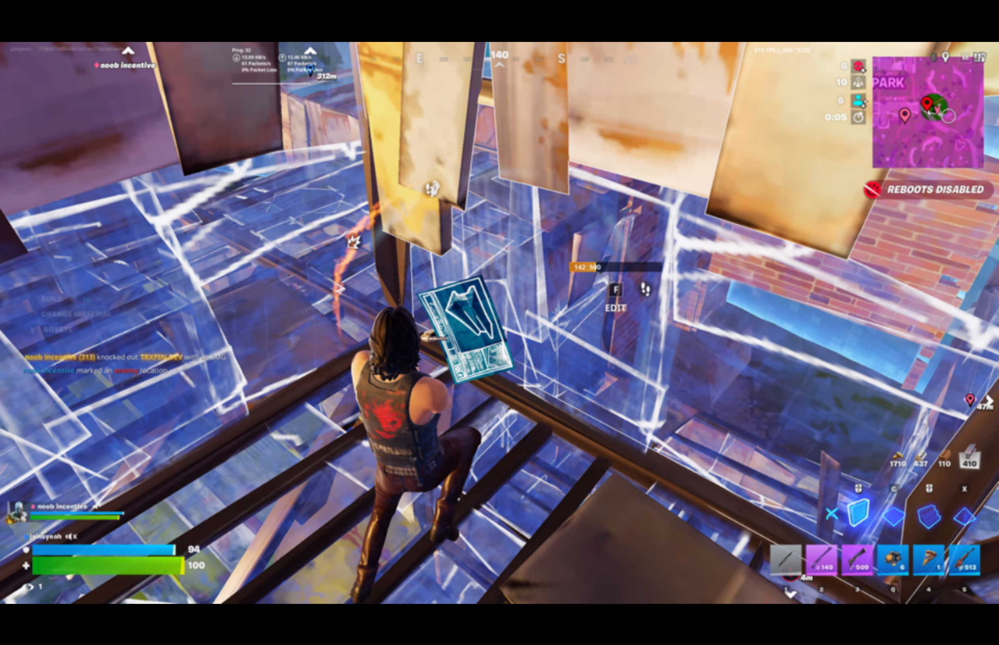

<div align="center">


# mp4trim

**Drag two handles. Hit Trim, or Discord MP4. Done.**

A fast MP4 trimmer with live playback, a zoomable thumbnail timeline, and
one-click exports that actually fit Discord's upload limit.




</div>

## Three ways out

| Button | What it does | Size |
| --- | --- | --- |
| **✂ Trim (lossless)** | Stream copy. Every track and all Dolby Vision / HDR10 metadata survive bit-exact. Takes seconds. | Same bitrate as the source. A 67 Mbps OBS clip is ~8 MB per second. |
| **💬 Discord MP4** | Re-encodes to H.264 (NVENC on NVIDIA GPUs, x264 otherwise) at a bitrate computed from your Discord tier. Checks the real size afterwards and retries lower if it overshot. | Always under the limit you picked. |
| **🎞 GIF** | Palette GIF, steps down size/fps until it fits your tier. | Under the limit, or it tells you to pick a shorter range. |

Every export is copied to the clipboard as a file, so Ctrl+V drops it
straight into Discord. **Show in folder** appears in the status bar.

**Auto-update**: on launch the app quietly checks the GitHub releases
page. When a newer version exists it downloads the installer in the
background and shows an "Update to X" button in the status bar; one
click installs it and restarts. Manual check: **Help -> Check for
updates**. Set MP4TRIM_NO_UPDATE=1 to disable.

Pick your tier (Free 20 MB, Nitro Basic 50 MB, Nitro 1 GB) in the
**Discord limit** box. It is remembered between runs.

### How Discord MP4 picks quality

The range label shows the plan live as you drag the handles, for example
`Lossless ≈ 415 MB · Discord 50 MB → 1080p60 · 7.0 Mbps ✓`.

1. Budget = 93% of the limit, minus audio (128 kbps, 96 on the free tier).
2. Video bitrate = budget ÷ length, never above the source's own bitrate.
3. Highest resolution/fps that still looks clean at that bitrate:
   1440p60 → 1080p60 → 1080p30 → 720p60 → 720p30 → 540p30 → 480p30.
4. Encode, measure, and re-encode lower if the file came out too big.

If a selection is too long to look acceptable even at 480p it warns you
first and tells you the longest length that fits.

Measured on a real 1440p60 AV1 OBS clip (51.5 s, 415 MB lossless):

| Tier | Result |
| --- | --- |
| 20 MB | ~19 MB, 720p60 |
| 50 MB | 47.3 MB, 1080p60 |
| 1 GB | 439 MB, 1440p60 (source bitrate, nothing to cut) |

## Editing

- **Browse the folder**: « and » (or PgUp / PgDn) jump to the previous or
  next video in the same folder, so you can work through a night of OBS
  clips without reopening. The status bar shows "clip N of M".
- **Fine scrubbing** (Apple style): while dragging the playhead or a
  handle, pull the mouse further below the timeline to slow the drag:
  ½ speed → ¼ speed → fine (about 3 ms per pixel, finer than one 60 fps
  frame). A badge above the playhead shows the active speed, and moving
  back up returns to full speed without jumping.
- **Frame-exact scrubbing**: dragging never waits on the video player.
  A scrub engine decodes whole keyframe-to-keyframe chunks into RAM
  (first frame in ~100 ms, then every frame in the chunk is instant) and
  the preview shows the true frame for each playhead position, 1:1 with
  the bar. Releasing the mouse hands the exact position back to normal
  playback. Uses up to ~420 MB of RAM while scrubbing, freed on close.
- **Timeline**: thumbnails, time ruler, green in-handle and red
  out-handle. Scroll to zoom around the cursor (Shift+scroll pans,
  double-click resets). The thin strip underneath is always the whole
  file, with your range and the zoom window on it.
- **Keyframe warning**: lossless cuts can only start on a keyframe. If
  your in-point is between keyframes the label warns how much earlier the
  clip will really start; press **K** to snap to it. Or turn on
  **Options → Frame-accurate trim** (re-encodes, drops Dolby Vision).
- **Playback** uses QtMultimedia (hardware decode + audio). If the system
  decoder fails on a file it switches to ffmpeg-decoded previews
  automatically, so colors are always right. HDR is tone-mapped for
  previews, snapshots, GIFs and Discord MP4s.
- **Snapshot**: grab the current frame at native resolution, drag to
  crop, copy to clipboard or save PNG.
- **Multiple audio tracks**: Discord MP4 uses track 1. **Options → Mix all
  audio tracks** mixes them instead (only turn this on if your tracks are
  different, e.g. game and mic, or the audio doubles in volume).

## Keyboard shortcuts

Everything works with buttons. These are faster. **F1** shows this list.

| Key | Action |
| --- | --- |
| `Space` | play / pause |
| `I` / `O` | set in / out at the playhead |
| `Home` / `End` | jump to in / out |
| `,` / `.` | previous / next frame |
| `Left` / `Right` | 1 s back / forward (`Shift` = 10 s) |
| `K` | snap in-point to keyframe |
| `Z` | reset timeline zoom |
| `Enter` | trim (lossless) |
| `D` | Discord MP4 |
| `G` | GIF |
| `S` | snapshot |
| `Ctrl+O` | open (drag & drop and **File → Open Recent** work too) |

Output names never overwrite anything:
`clip_trim_0m14s-0m36s.mp4`, `clip_discord50mb_0m14s-0m36s.mp4`, then
`… (2).mp4` if that exists.

## Install & run

**Installer (any Windows 10/11 x64 PC):** download `mp4trim-*-win64.msi`
from the [Releases page](https://github.com/blarer/mp4trim/releases) and
run it. It is self-contained: Python, Qt, the Visual C++ runtime and
ffmpeg/ffprobe are all inside, so nothing else needs to be installed.
Per-user install, no admin, Start Menu shortcut; upgrades replace the old
version in place.

- NVIDIA GPU: Discord MP4 encodes on NVENC (fast).
- Any other GPU / no GPU: it automatically uses the x264 CPU encoder.
  Same size targets, just slower.
- **Help → About** shows which ffmpeg and encoder it is using.

**From source:**

```
pip install PySide6
python fetch_ffmpeg.py        # once: downloads ffmpeg into ./ffmpeg
python mp4trim.py [file.mp4]
```

Without `./ffmpeg` it falls back to ffmpeg on PATH
(`winget install Gyan.FFmpeg`). The app tells you if neither is found.

## Build the MSI

```
pip install cx_Freeze
python fetch_ffmpeg.py
python setup.py bdist_msi
```

The build refuses to run without `./ffmpeg`, so an installer can never
ship without it.

## Checks

These run against real clips (they encode video, so they are not a fast
unit suite):

```
python tests/run_all.py <clip.mp4>            # recommended: all suites below, timeouts + summary table (--fast skips the two slow export suites)
python tests/check_exports.py <clip.mp4> ...   # every tier: size, codec, audio, duration
python tests/ui_smoke.py <clip.mp4>           # drives the window: marks, zoom, export, cancel
python tests/quality_compare.py <clip.mp4>    # side-by-side frame + color tags
python tests/check_misc.py <clip.mp4>         # GIF ladder, frame-accurate, handles, snapshot
python tests/check_v21.py <clip.mp4>          # fine scrubbing, folder nav, OLED theme
python tests/check_glass.py <clip.mp4>        # liquid-glass panels: auto-hide, volume, mute, fullscreen
python tests/check_update.py                  # auto-updater: feed rules, download, UI
python tests/check_tiers.py <clip.mp4>        # Discord tier limits on a real clip
python tests/check_scrub.py <clip.mp4>        # scrub engine: latency, exactness, cache, UI
python tests/check_portable.py <app_dir> <clip.mp4>  # stripped PATH, no NVENC: bundled ffmpeg + x264
python tests/accept_installed.py <clip.mp4>   # installed app, real 'D' keypress, checks output
python tests/make_screenshot.py <clip.mp4>    # regenerates docs/screenshot.png
```

## Project layout

```
mp4trim.py     the whole app: UI, playback, export planning, ffmpeg wiring
setup.py       cx_Freeze build → exe + MSI
fetch_ffmpeg.py downloads the ffmpeg that the installer bundles
make_icon.py   regenerates icon.ico / icon.png
tests/         real-file export checks, UI smoke test, screenshot renderer
docs/          README images
```
