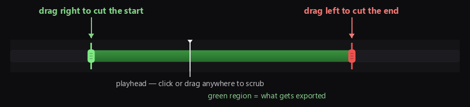
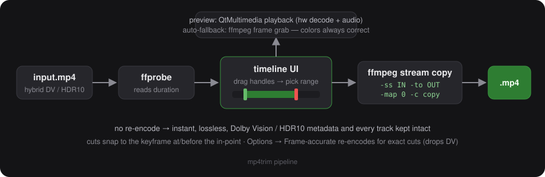

<div align="center">


# mp4trim

**Drag two handles. Hit Trim. Done.**

A minimal MP4 trimmer with live playback and a drag-handle timeline —
built for hybrid Dolby Vision / HDR10 files that other tools mangle.


</div>

## Why

Trimming a hybrid DV/HDR10 file in a normal editor usually means one of
two failures: the preview renders green/purple (Windows decoders choke
on some DV profiles), or the export re-encodes and silently strips the
Dolby Vision metadata. mp4trim avoids both:

- **Playback** runs on QtMultimedia (hardware decode + audio). If the
  system decoder fails on a file, the app automatically drops to
  ffmpeg-decoded frame previews — colors always correct.
- **Trimming** is a pure stream copy (`-map 0 -c copy`). No re-encode,
  so every track and all DV/HDR10 metadata survive bit-exact. A
  half-hour cut takes seconds.
- **Snapshots**: `S` grabs the current frame at native resolution
  (decoded by ffmpeg, so colors are right), then drag to crop and copy
  to clipboard or save as PNG.

## How the timeline works

<div align="center">

</div>

Pull the **green** handle right to cut the beginning, pull the **red**
handle left to cut the end. Dragging a handle previews the exact frame
you're cutting on. The green region is what gets exported — output
lands next to the source as `name_trim_START-END.mp4`.

## How it works under the hood

<div align="center">

</div>

## Keyboard

| Key | Action |
| --- | --- |
| `Space` | play / pause |
| `S` | snapshot current frame → crop → copy to clipboard / save PNG |
| `Left` / `Right` | step 1 s (`Shift` = 10 s) |
| `Enter` | trim |
| `Ctrl+O` | open — drag & drop works too |

## Install & run

**From source:**

```
pip install PySide6
python mp4trim.py [file.mp4]
```

Requires **ffmpeg / ffprobe on PATH** (not bundled) — e.g.
`winget install Gyan.FFmpeg`.

**From the installer:** grab `mp4trim-*.msi` from `dist/` (or build it
below). Installs per-user, no admin, Start Menu shortcut included;
upgrades replace the old version in place.

## Build the MSI

```
pip install cx_Freeze
python setup.py bdist_msi
```

## Good to know

- Stream copy cuts snap to the keyframe at/before the in-point, so the
  start can land a few seconds early. **Options → Frame-accurate**
  re-encodes video (x264 CRF 18) for exact cuts — but that drops Dolby
  Vision metadata, so leave it off for hybrid files.
- **Options → Force ffmpeg preview** disables live playback entirely
  and scrubs ffmpeg-decoded frames — use it when a file plays with
  wrong colors (DV profile 5 and friends).
- `icon.ico` is generated by `make_icon.py` (Pillow); README images are
  rendered from the real app.

## Project layout

```
mp4trim.py     the whole app — UI, playback, ffmpeg wiring
setup.py       cx_Freeze build → exe + MSI
make_icon.py   regenerates icon.ico / icon.png
docs/          README images
```
